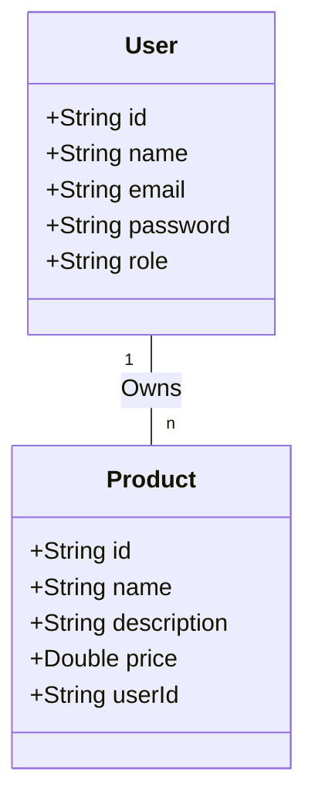

# letsplay
Github repo for the lets-play project at grit:lab

## Copied task description

### Objectives

You will be developing a basic CRUD (Create, Read, Update, Delete) API using Spring Boot with MongoDB, and it should adhere to RESTful principles. The application will contain user management and product management functionalities.

### Instructions

#### 1. Database Design



#### 2. API Development

You should provide a set of RESTful APIs to perform CRUD operations on both Users and Products. The APIs should be designed according to the REST standard. The "GET Products" API should be accessible without authentication.

#### 3. Authentication & Authorization

Implement a token-based authentication system. Only authenticated users can access the APIs. The users can have different roles (admin or user), and the API access should be controlled based on the user roles.

> 💡 Spring Security 

#### 4. Error Handling

The API should not return any 5XX errors. You should handle any possible exceptions and return appropriate HTTP response codes and messages.

#### 5. Security Measures

Implement the following security measures:

- Hash and salt passwords before storing them in the database.
- Validate inputs to prevent MongoDB injection attacks.
- Protect sensitive user information. Don't return passwords or other sensitive information in your API responses.
- Use HTTPS to protect data in transit.

### Bonus 

As an additional challenge, you could consider implementing the following features. Note that these are not required for the completion of the project but would provide additional learning opportunities:

- **Set appropriate CORS policies:** Implement Cross-Origin Resource Sharing (CORS) policies to manage the security of your application when it is accessed from different domains.
- **Implement rate limiting to prevent brute force attacks:** Use rate limiting to restrict the number of API requests a client can make in a given time. This can help prevent attacks and misuse of your application.

### Testing

Your project will be extensively tested for the following aspects:

- Correctness of the APIs.
- Proper implementation of authentication and authorization.
- The absence of 5XX errors.
- Implementation of the above-mentioned security measures.

In order for auditors to test your program, you will have to run your project using a code editor or provide a script to run it.

### Resources
[Spring initializer](https://start.spring.io/)
[Rest Documentation](https://docs.github.com/en/rest?apiVersion=2022-11-28)


### Structure
```
letsplay/
├── src/
│   ├── main/
│   │   ├── java/com/example/letsplay/
│   │   │   ├── LetsPlayApplication.java      # Main entry point
│   │   │   │
│   │   │   ├── model/                        # Entities (MongoDB documents)
│   │   │   │   ├── User.java
│   │   │   │   └── Product.java
│   │   │   │
│   │   │   ├── repository/                   # MongoDB Repositories
│   │   │   │   ├── UserRepository.java
│   │   │   │   └── ProductRepository.java
│   │   │   │
│   │   │   ├── service/                      # Business logic
│   │   │   │   ├── UserService.java
│   │   │   │   └── ProductService.java
│   │   │   │
│   │   │   ├── controller/                   # REST Controllers
│   │   │   │   ├── UserController.java
│   │   │   │   └── ProductController.java
│   │   │   │
│   │   │   ├── security/                     # JWT + Spring Security config
│   │   │   │   ├── SecurityConfig.java
│   │   │   │   ├── JwtAuthenticationFilter.java
│   │   │   │   ├── JwtUtil.java
│   │   │   │   └── CustomUserDetailsService.java
│   │   │   │
│   │   │   ├── exception/                    # Centralized exception handling
│   │   │   │   └── GlobalExceptionHandler.java
│   │   │   │
│   │   │   └── dto/                          # Data Transfer Objects (for API requests/responses)
│   │   │       ├── LoginRequest.java
│   │   │       ├── LoginResponse.java
│   │   │       └── RegisterRequest.java
│   │   │
│   │   └── resources/
│   │       ├── application.properties        # Config
│   │       └── application-dev.properties    # (optional for dev env)
│   │
│   └── test/java/com/example/letsplay/       # Unit + Integration tests
│       └── LetsPlayApplicationTests.java
│
├── .gitignore
├── pom.xml                                  # Maven dependencies
├── README.md
└── todo.md                                  # Your planning file
```

What each folder does

model/ → User and Product classes with @Document, @Id annotations.

repository/ → extends MongoRepository<User, String> style interfaces.

service/ → keeps business logic (don’t cram everything in controllers).

controller/ → REST endpoints with @RestController.

security/ → JWT filter, token utils, and role-based access config.

dto/ → request/response objects (e.g. register, login). Keeps API clean.

exception/ → @ControllerAdvice class that maps exceptions → HTTP responses (no 500s)